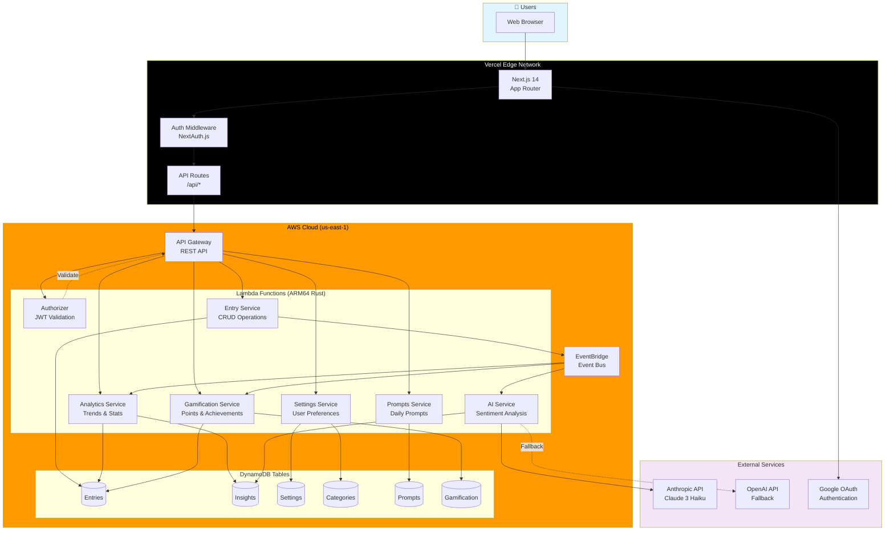
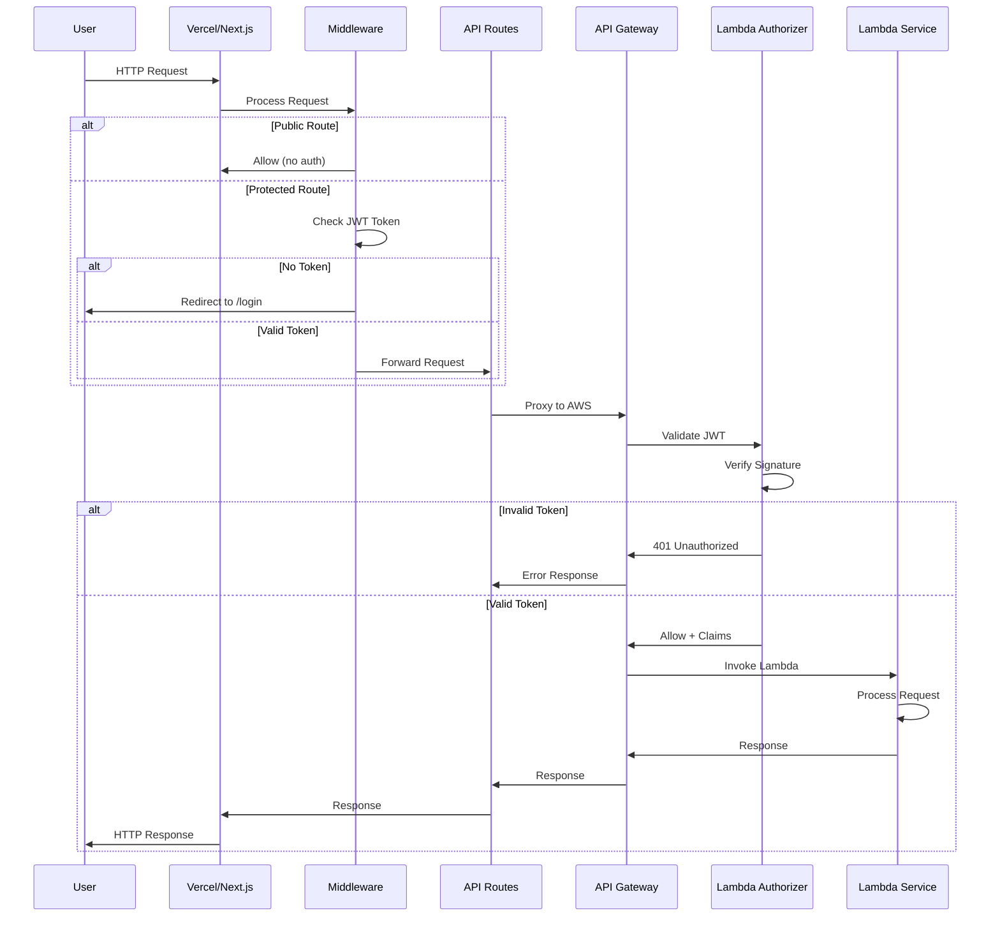
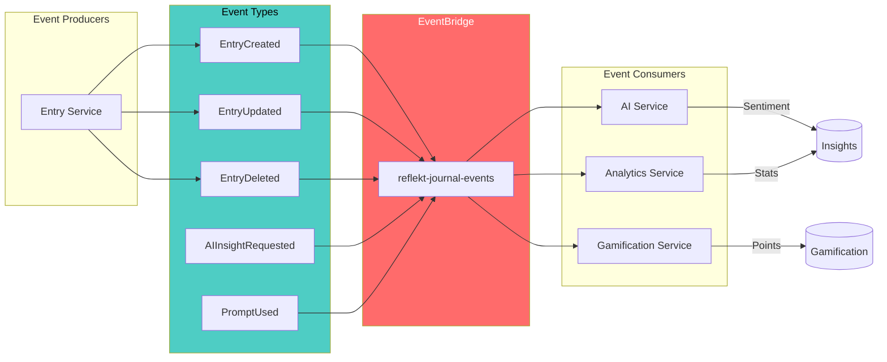
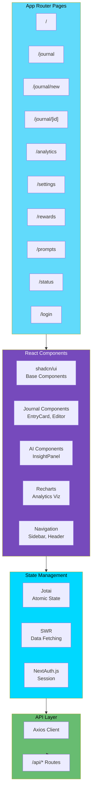
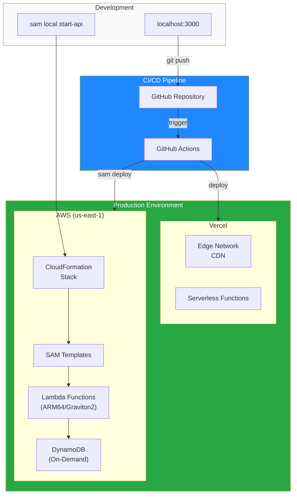

# ✨ Reflekt

A modern, AI-powered journaling application with Next.js frontend and serverless Rust microservices on AWS.

[](https://refleckt.vercel.app)
[](https://aws.amazon.com)
[](https://vercel.com)

## 📚 Table of Contents

- [🌟 Overview](#-overview)
- [✨ Features](#-features)
- [🏗️ Architecture](#️-architecture)
- [🛠️ Tech Stack](#️-tech-stack)
- [🚀 Quick Start](#-quick-start)
- [💻 Development](#-development)
- [☁️ Deployment](#️-deployment)
- [📡 Status Monitoring](#-status-monitoring)
- [💰 Cost Estimation](#-cost-estimation)
- [👨‍💻 Author](#-author)

## 🌟 Overview

Reflekt is a personal journaling application featuring AI-powered insights, sentiment analysis, and reflective question generation. Built with a multi-tenant serverless architecture for scalability and cost efficiency.

**🔗 Live:** [https://refleckt.vercel.app](https://refleckt.vercel.app)

## ✨ Features

| Category | Features |
|----------|----------|
| 📔 **Journal** | CRUD entries, rich text, smart color-coded tags, pagination, search |
| 🧠 **AI Insights** | On-demand sentiment analysis, keyword extraction, reflective questions |
| 🏆 **Gamification** | Points system, levels, achievements, streaks, rewards dashboard |
| 📊 **Analytics** | Interactive charts (Recharts), mood trends, writing patterns, AI summaries |
| 🎨 **UI/UX** | Dark/light theme, responsive design, skeleton loading, relative dates |
| 💡 **Daily Prompts** | Refreshable prompts, "Get Another" for variety, category filtering |
| 🔒 **Security** | JWT auth, multi-tenant isolation, encrypted data |
| 📡 **Status Monitor** | Real-time AWS service health, DynamoDB stats, API metrics |

### UI Highlights

- **Smart Tag Colors** - Semantic color mapping with hash-based fallback for consistent, theme-aware tag badges
- **Paginated Journal** - Configurable entries per page (5/10/20/50) with page navigation
- **Interactive Analytics** - Area charts, line graphs, pie charts, and bar charts powered by Recharts
- **Relative Dates** - Human-friendly timestamps ("Just now", "2 hours ago", "Yesterday")
- **Mood Badges** - Visual mood indicators with emoji support
- **Rewards Dashboard** - Track points, levels, achievements, and streaks in a dedicated page
- **AI Opt-In Insights** - User-controlled AI analysis with "Get AI Insights" button per entry

## 🏗️ Architecture

### High-Level Overview



### Request Flow & Middleware



### Event-Driven Architecture



### Frontend Architecture



### Data Model (DynamoDB)

```mermaid
erDiagram
    ENTRIES {
        string id PK
        string tenant_id SK
        string user_id
        string title
        string content
        string mood
        array tags
        datetime created_at
        datetime updated_at
    }

    INSIGHTS {
        string entry_id PK
        string tenant_id SK
        string user_id
        float sentiment_score
        array keywords
        array questions
        string summary
    }

    SETTINGS {
        string tenant_id PK
        string user_id SK
        string theme
        boolean notifications
        json preferences
    }

    CATEGORIES {
        string id PK
        string tenant_id SK
        string user_id
        string name
        string color
    }

    PROMPTS {
        string id PK
        string category GSI
        string text
        boolean active
    }

    GAMIFICATION {
        string pk PK
        string sk SK
        string tenant_id GSI
        int points
        int level
        array achievements
        int streak
        datetime last_activity
    }

    ENTRIES ||--o| INSIGHTS : "has"
    ENTRIES }|--|| CATEGORIES : "belongs to"
    ENTRIES ||--o{ GAMIFICATION : "earns points"
```

### Deployment Architecture



### 🏢 Multi-Tenant Design

- **Partition Strategy:** `tenant_id` + `user_id` composite keys
- **Data Isolation:** JWT-enforced tenant boundaries
- **GSI Pattern:** Efficient cross-tenant queries with UserIndex

## 🛠️ Tech Stack

| Layer | Technology |
|-------|------------|
| **Frontend** | Next.js 14, React 18, TypeScript, Tailwind CSS, shadcn/ui, Recharts |
| **Backend** | Rust (ARM64), AWS Lambda, API Gateway, DynamoDB |
| **AI** | Anthropic API (claude-3-haiku), OpenAI (fallback) |
| **Events** | Amazon EventBridge |
| **Auth** | JWT + Custom Lambda Authorizer |
| **IaC** | AWS SAM / CloudFormation |

## 🚀 Quick Start

### Prerequisites

- Node.js 18+, Yarn
- Rust 1.85.0+
- AWS CLI + SAM CLI
- Vercel CLI (optional)

### Frontend

```bash
cd frontend
cp .env.example .env.local
yarn install && yarn dev
```

### Backend

```bash
cd backend
source ./scripts/set_env.sh
make build-all
./scripts/deploy-stack.sh -s dev -r us-east-1
```

## 💻 Development

| Command | Description |
|---------|-------------|
| `yarn dev` | Start frontend (localhost:3000) |
| `yarn test` | Run Jest tests |
| `yarn cypress:headless` | E2E tests |
| `make build-all` | Build all Rust services |
| `sam local start-api` | Local API Gateway |

## ☁️ Deployment

### Backend (AWS)

```bash
cd backend
source ./scripts/set_env.sh
./scripts/deploy-stack.sh -s prod -r us-east-1
```

### Frontend (Vercel)

```bash
cd frontend
vercel --prod
```

## 📡 Status Monitoring

Reflekt includes a production-grade AWS service status monitoring dashboard accessible at `/status`.

### Features

| Component | Metrics |
|-----------|---------|
| **Lambda Services** | Health status, latency, uptime, error rates |
| **DynamoDB Tables** | Item counts, table sizes, GSI/LSI counts (via AWS SDK) |
| **API Gateway** | Request counts, error rates, average latency |
| **EventBridge** | Event bus status, rule counts |
| **AI Service** | Provider status, analysis counts, token usage, cost estimates |
| **Prompts Service** | Total prompts, category distribution |

### Technical Implementation

- **Real-time health checks** - Direct HTTP probes to all Lambda endpoints
- **AWS SDK integration** - `DescribeTableCommand` for actual DynamoDB statistics
- **Latency tracking** - In-memory history with percentile calculations (P50/P95/P99)
- **Smart caching** - 30s TTL with stale-while-revalidate pattern
- **Offline support** - LocalStorage caching with automatic refresh
- **Visibility-aware polling** - Pauses when tab is hidden, refreshes on focus

### Access

```
https://refleckt.vercel.app/status
```

## 💰 Cost Estimation

**Low Traffic (~1K users, ~10K req/month):**

| Service | Cost/Month |
|---------|------------|
| Lambda (ARM64) | ~$0.50 |
| API Gateway | ~$3.50 |
| DynamoDB (on-demand) | ~$2.00 |
| EventBridge | ~$0.01 |
| Anthropic API | ~$1.00 |
| **Total** | **~$7/month** |

*Vercel Hobby tier: Free*

## 📁 Project Structure

```
reflekt-journal-app/
├── frontend/                    # Next.js 14 App Router
│   ├── app/                     # Pages & API routes
│   │   ├── analytics/           # Analytics dashboard with Recharts
│   │   ├── journal/             # Journal entries with pagination
│   │   └── status/              # AWS service monitoring
│   ├── components/
│   │   ├── ui/                  # shadcn/ui + custom components
│   │   │   └── tag-badge.tsx    # Smart color-coded tag badges
│   │   ├── ai/                  # AI insight components
│   │   └── DailyPrompt.tsx      # Refreshable writing prompts
│   └── lib/
│       ├── tag-colors.ts        # Semantic tag color mapping
│       └── date-utils.ts        # Relative date formatting
├── backend/                     # Rust microservices (ARM64)
│   ├── entry-service/           # Journal CRUD operations
│   ├── ai-service/              # AI analysis (Anthropic/OpenAI)
│   ├── analytics-service/       # Usage analytics
│   ├── settings-service/        # User preferences
│   ├── prompts-service/         # Writing prompts
│   ├── authorizer/              # JWT Lambda authorizer
│   └── infrastructure/          # SAM/CloudFormation templates
└── docs/                        # Documentation
```

## 👨‍💻 Author

**Eric Gitangu (Deveric)**

[](mailto:developer.ericgitangu@gmail.com)
[](https://developer.ericgitangu.com)

## 📄 License

MIT License - see [LICENSE](LICENSE) for details.
