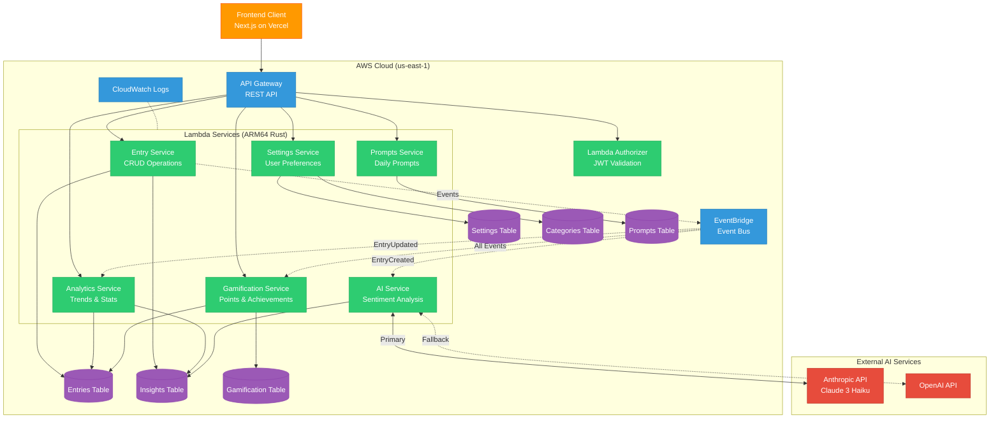
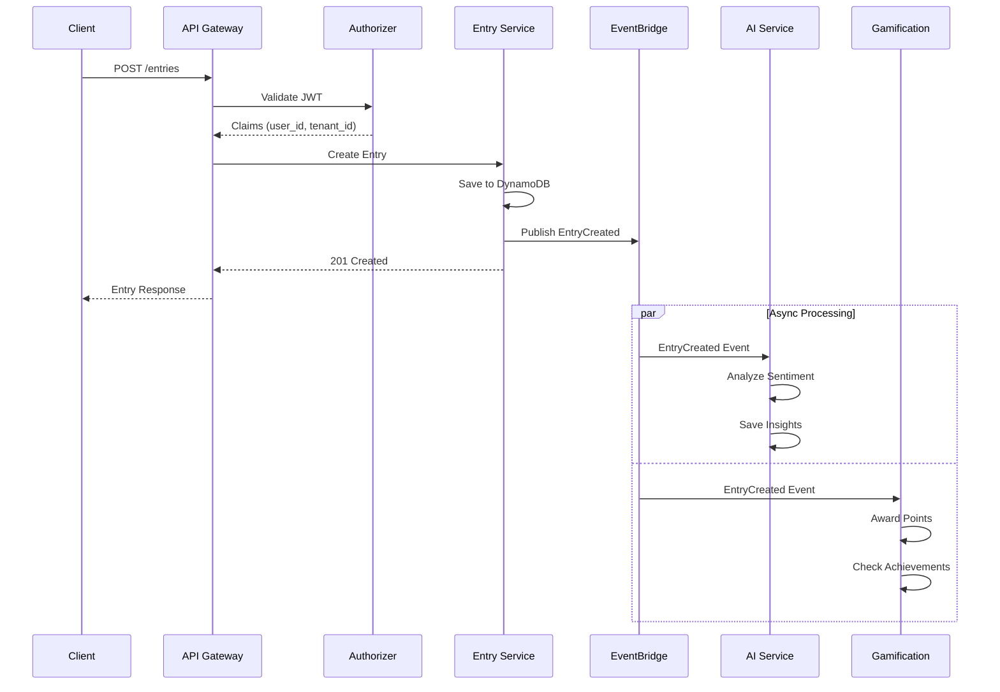

# Reflekt Journal Backend Architecture

The following diagrams illustrate the serverless architecture of the Reflekt Journal backend system, showing how the different AWS Lambda-based microservices interact with each other and with AWS services.

## Architecture Diagram



## Service Interaction Flow



## Component Description

### Client-Facing Components
- **Frontend Client**: Next.js 14 App Router application hosted on Vercel
- **API Gateway**: AWS REST API Gateway serving as the entry point for all backend requests with JWT authentication

### Serverless Services (ARM64 Rust)
All Lambda functions are compiled for ARM64 (Graviton2) using Rust for optimal performance and cost efficiency.

| Service | Description | Endpoints |
|---------|-------------|-----------|
| **Lambda Authorizer** | Validates JWT tokens from NextAuth.js | N/A (internal) |
| **Entry Service** | CRUD operations for journal entries | `/entries`, `/entries/{id}`, `/entries/search`, `/entries/export` |
| **Analytics Service** | Mood trends, writing patterns, statistics | `/analytics`, `/analytics/mood` |
| **Settings Service** | User preferences and categories | `/settings`, `/settings/categories` |
| **AI Service** | Sentiment analysis via Anthropic/OpenAI | Event-driven (no direct API) |
| **Prompts Service** | Daily writing prompts management | `/prompts`, `/prompts/daily`, `/prompts/random` |
| **Gamification Service** | Points, levels, achievements, streaks | `/gamification/stats`, `/gamification/transactions`, `/gamification/achievements` |

### AWS Managed Services
- **DynamoDB Tables** (On-Demand billing):
  | Table | Primary Key | GSI | Purpose |
  |-------|-------------|-----|---------|
  | Entries | `id` + `tenant_id` | UserIndex, DateIndex | Journal entries |
  | Insights | `entry_id` + `tenant_id` | UserIndex | AI-generated insights |
  | Settings | `tenant_id` + `user_id` | - | User preferences |
  | Categories | `id` + `tenant_id` | UserIndex | Entry categories |
  | Prompts | `id` | category-index | Writing prompts |
  | Gamification | `pk` + `sk` | TenantIndex | Points, achievements |

- **EventBridge**: Event bus for async communication
  - Events: `EntryCreated`, `EntryUpdated`, `EntryDeleted`, `AIInsightRequested`, `PromptUsed`
- **CloudWatch**: Centralized logging and monitoring

### External Services
- **Anthropic API** (Primary): Claude 3 Haiku for sentiment analysis
- **OpenAI API** (Fallback): GPT models as backup
- **Google OAuth**: Authentication via NextAuth.js

### Shared Components
- **Common Library** (`journal-common`): Shared Rust crate with models, utilities, and DynamoDB abstractions

## Communication Patterns

1. **Synchronous (Request/Response)**
   - Client → Vercel → API Gateway → Lambda → DynamoDB

2. **Asynchronous (Event-Driven)**
   - Entry Service → EventBridge → AI Service / Gamification Service
   - Decoupled processing for non-blocking operations

3. **Multi-Tenant Isolation**
   - All data partitioned by `tenant_id` + `user_id`
   - JWT claims enforce data boundaries

## API Endpoints Summary

```
GET/POST       /entries              # List/Create entries
GET/PUT/DELETE /entries/{id}         # Single entry operations
GET            /entries/search       # Full-text search
GET            /entries/export       # Export data
GET/PUT        /settings             # User settings
GET/POST       /settings/categories  # Manage categories
GET/POST       /analytics            # Analytics data
GET            /analytics/mood       # Mood trends
GET            /prompts              # List prompts
GET            /prompts/daily        # Daily prompt
GET            /prompts/random       # Random prompt
GET            /gamification/stats   # User stats
GET            /gamification/transactions  # Point history
GET            /gamification/achievements  # User achievements
```

## Deployment Architecture

The services are deployed using AWS SAM (Serverless Application Model) and AWS CloudFormation:

| Feature | Implementation |
|---------|----------------|
| **IaC** | CloudFormation via SAM templates |
| **Environments** | dev, staging, prod stacks |
| **CI/CD** | GitHub Actions |
| **Runtime** | provided.al2 (custom runtime) |
| **Architecture** | ARM64 (Graviton2) |
| **Monitoring** | CloudWatch Logs + Metrics |
| **Scaling** | On-demand Lambda + DynamoDB |

Each Lambda function is independently scalable and maintained, providing true serverless microservices architecture with sub-100ms cold starts due to Rust's minimal runtime overhead. 