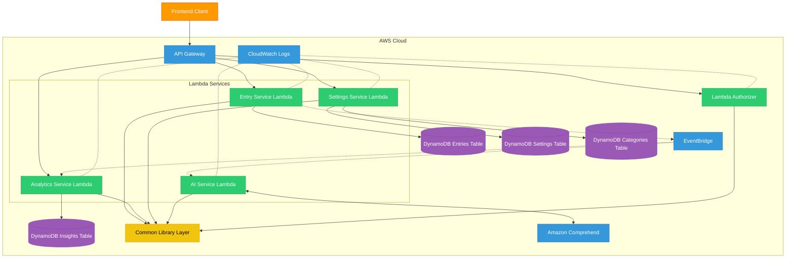

# Reflekt Journal Backend Architecture

The following diagram illustrates the serverless architecture of the Reflekt Journal backend system, showing how the different AWS Lambda-based microservices interact with each other and with AWS services.

## Architecture Diagram

## Component Description

### Client-Facing Components
- **Frontend Client**: The React-based web application
- **API Gateway**: AWS API Gateway that serves as the entry point for all client requests, with JWT authentication

### Serverless Services
- **Lambda Authorizer**: Custom authorizer for API Gateway that validates JWT tokens
- **Entry Service Lambda**: Manages journal entries (CRUD operations) and stores them in DynamoDB
- **Analytics Service Lambda**: Processes journal data to provide insights and statistics
- **Settings Service Lambda**: Manages user preferences and application settings
- **AI Service Lambda**: Provides AI-powered features using Amazon Comprehend

### AWS Managed Services
- **DynamoDB Tables**: NoSQL database for storing application data
  - **Entries Table**: Stores journal entries
  - **Settings Table**: Stores user settings
  - **Categories Table**: Stores entry categories
  - **Insights Table**: Stores analytics results
- **EventBridge**: Event bus for asynchronous communication between services
- **CloudWatch**: Monitoring and logging service
- **Comprehend**: Natural language processing service for sentiment analysis

### Shared Components
- **Common Library Layer**: Lambda layer with shared code, models, and utilities

## Communication Patterns

1. **Synchronous Communication**: API Gateway for direct client-to-service communication
2. **Asynchronous Communication**: EventBridge for event-driven processing
3. **Database Access**: Each Lambda function has access to specific DynamoDB tables

## Deployment Architecture

The services are deployed using AWS SAM (Serverless Application Model) and AWS CloudFormation with the following features:

- **Infrastructure as Code**: All resources defined in CloudFormation templates
- **Multi-Environment Support**: Separate stacks for dev, staging, and production
- **CI/CD Pipeline**: Automated deployment using GitHub Actions
- **Observability**: Comprehensive logging and monitoring with CloudWatch
- **Scalability**: Auto-scaling Lambda functions based on demand

Each Lambda function is independently scalable and maintained, providing true serverless microservices architecture. 